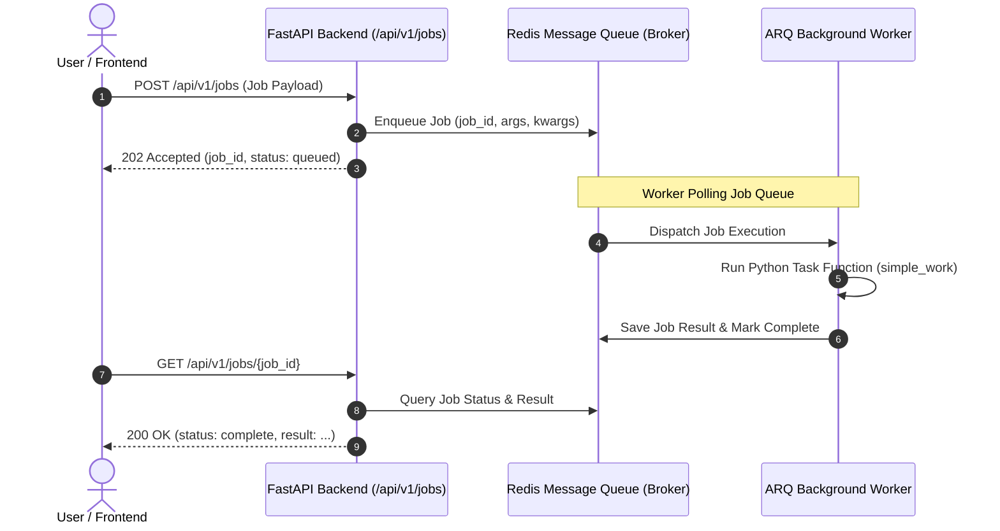

# Workers & Asynchronous Task Processing ⚡

ไดเรกทอรี `workers/` (และโมดูล `backend/worker_settings.py`) ทำหน้าที่ดูแลระบบประมวลผลงานแบบ Asynchronous Background Workers โดยอาศัย **Redis** เป็น Message Broker และ **ARQ** เป็น Worker Framework

---

## 🏗️ Architecture & Flow



---

## ⚙️ การตั้งค่าและไฟล์ที่เกี่ยวข้อง

1. **General Worker (`backend/worker_settings.py`)**:
   - กำหนด `WorkerSettings` และรายชื่อฟังก์ชันที่ Worker ทั่วไปสามารถประมวลผลได้ (เช่น `simple_work`)
2. **Trainer Worker (`workers/trainer/`)**:
   - Worker สำหรับเทรน Deep Learning โมเดลบน GPU โดยเฉพาะ รันแยก Container และฟังงานจาก `training_queue` (ดูรายละเอียดใน [workers/trainer/README.md](trainer/README.md))
3. **Data Seeding Scripts (`workers/scripts/`)**:
   - สคริปต์เตรียมข้อมูล Dataset เข้า MinIO ล่วงหน้า (ดูรายละเอียดใน [workers/scripts/README.md](scripts/README.md))
4. **`backend/services/job_service.py`**:
   - ให้บริการ Enqueue งานเข้าสู่คิวผ่าน Connection Pool พร้อมรองรับ `defer_until` และ `queue_name`
5. **`compose.yml`**:
   - จัดการ Container Redis, MinIO, PostgreSQL, Label Studio, และ `trainer-worker` (พร้อม NVIDIA GPU Passthrough)

---

## 🚀 วิธีการรัน Background Workers

### 1. รัน General Worker (คิวทั่วไป: `arq:queue`)
```powershell
cd backend
.\.venv\Scripts\arq.exe worker_settings.WorkerSettings
```

### 2. รัน Trainer Worker (คิวงานเทรน: `training_queue`)
```bash
docker compose up -d --build trainer-worker
```
