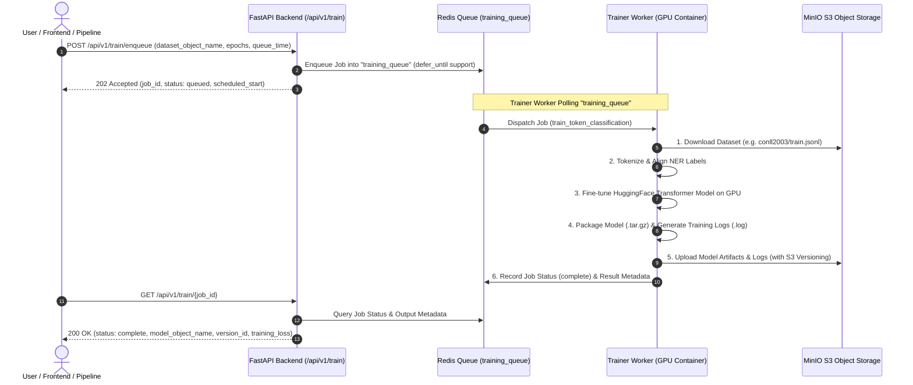

# Trainer Worker (GPU-Accelerated Model Training) 🤖⚡

Trainer Worker เป็น Background Worker แบบแยก Container ที่ถูกออกแบบมาสำหรับงานประมวลผลโมเดล Deep Learning (Token Classification / NER) โดยเฉพาะ โดยรองรับการเข้าถึง GPU ผ่าน NVIDIA Container Toolkit และแยกคิวการทำงานผ่าน **ARQ Task Queue** (`training_queue`) เพื่อไม่ให้ปะปนกับ Worker งานทั่วไป

---

## 🏗️ Architecture & Workflow



---

## 📂 โครงสร้างไฟล์ใน `workers/trainer/`

| ไฟล์ | หน้าที่และความรับผิดชอบ |
| :--- | :--- |
| **`Dockerfile`** | Docker Image Base บน `nvidia/cuda:12.1.1-cudnn8-runtime-ubuntu22.04` พร้อม Python 3.11 และ PyTorch GPU |
| **`requirements.txt`** | ระบุ Library สำหรับเทรน (`torch`, `transformers`, `datasets`, `accelerate`, `minio`, `arq`, `redis`) |
| **`worker_settings.py`** | การตั้งค่า ARQ Worker ให้ฟังเฉพาะคิว `training_queue` และผูกกับฟังก์ชัน `train_token_classification` |
| **`train_job.py`** | Business Logic การเทรนโมเดล Token Classification (โหลดข้อมูลจาก MinIO, Train ด้วย HuggingFace Trainer, Compress & Upload) |
| **`minio_client.py`** | S3 Helper แบบ Standalone สำหรับเชื่อมต่อ MinIO, ตรวจสอบ/เปิด Versioning ใน Bucket, และ Download/Upload ไฟล์ |
| **`logs/`** | ไดเรกทอรีเก็บ Local Training Log Files ของแต่ละ Job (`train_{job_id}.log`) |

---

## ⚙️ Environment Variables

| ตัวแปร | ค่า Default | รายละเอียด |
| :--- | :--- | :--- |
| `REDIS_HOST` | `redis` | Hostname ของ Redis Message Broker |
| `REDIS_PORT` | `6379` | Port ของ Redis |
| `MINIO_ENDPOINT` | `minio:9000` | Endpoint สำหรับเชื่อมต่อ MinIO S3 |
| `MINIO_ACCESS_KEY`| `admin` | MinIO Access Key |
| `MINIO_SECRET_KEY`| `password123` | MinIO Secret Key |
| `DATASET_BUCKET` | `datasets` | Bucket สำหรับดึงชุดข้อมูลมาเทรน |
| `MODEL_BUCKET` | `models` | Bucket สำหรับเก็บไฟล์ Model Artifacts และ Logs |
| `BASE_MODEL_NAME` | `distilbert-base-uncased` | Hugging Face Pre-trained Base Model |
| `LOG_DIR` | `/app/logs` | ไดเรกทอรีบันทึก Log ภายใน Container |

---

## 🚀 การรันและการทดสอบ

### รันผ่าน Docker Compose (แนะนำ)
```bash
docker compose up -d --build trainer-worker
```

### ตรวจสอบการทำงานของ Worker
```bash
docker compose logs -f trainer-worker
```
